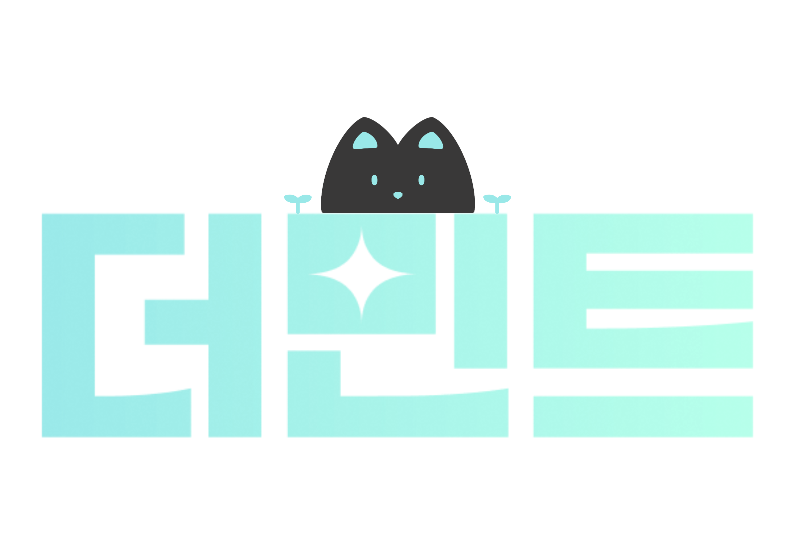
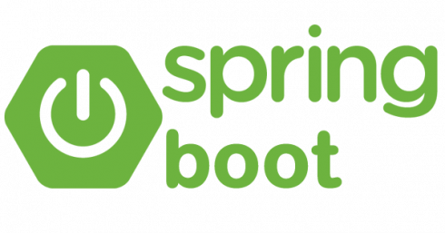
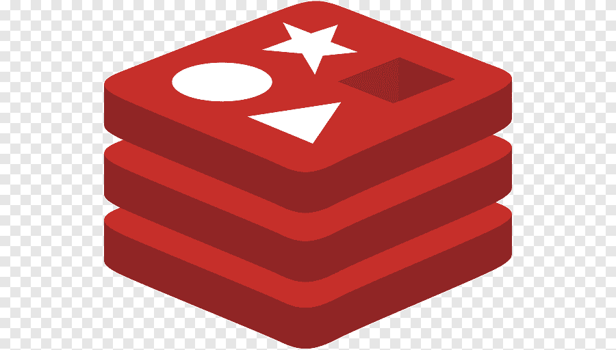
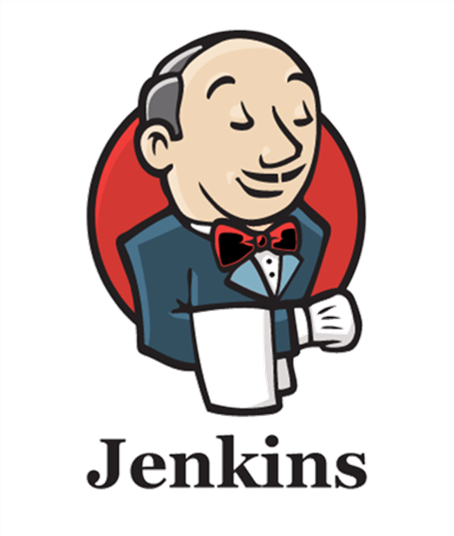
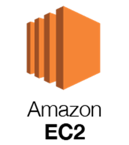
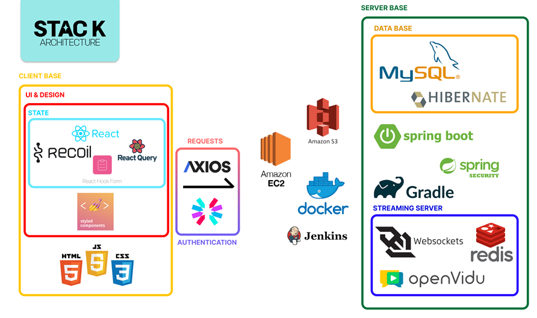
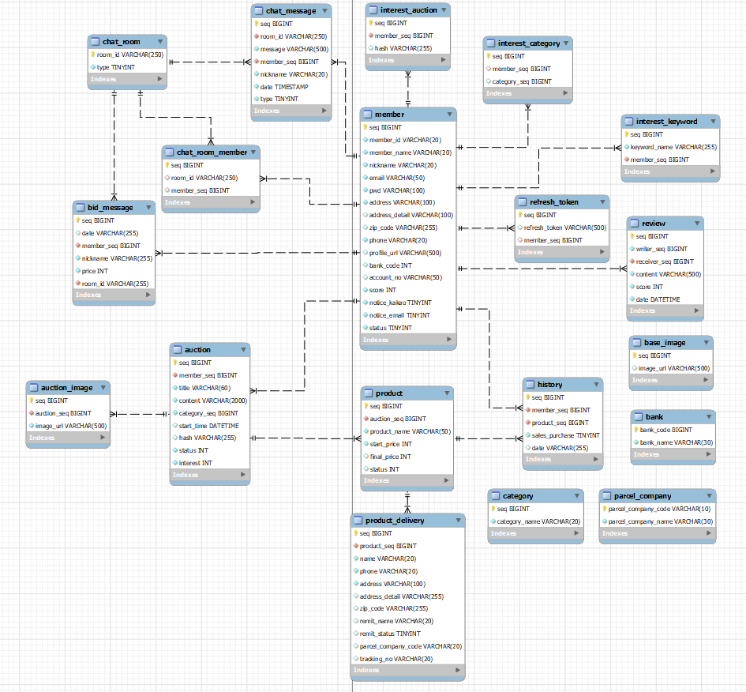

<div align="center">
  <br />
  
  <br />
  <h1>THE MINT : 더민트</h1>
    <div>
    
    
  </div>
  <br />
</div>

## 목차

1. [**웹 서비스 소개**](#1)
2. [**버전 기록**](#2)
3. [**기술 스택**](#3)
4. [**주요 기능**](#4)
5. [**프로젝트 구성도**](#5)
6. [**UCC 영상**](#6)
7. [**개발 팀 소개**](#7)
8. [**개발 기간 및 일정**](#8)
9. [**실행 방법**](#9)

<br />

<div id="1"></div>

## 📖 웹 서비스 소개

> **더민트(THE MINT)** 는 새것과 같은 상태라는 'mint condition'에 더(More)를 추가하여  
> '더욱더 새것과 같은 상태의 물품들을 거래한다'라는 의미를 가지고 있습니다.

<br /> 

더민트를 통해 판매자는 스트리밍으로 중고거래를 진행하여  
한 번의 스트리밍으로 여러 물품들을 빠르게 거래 할 수 있습니다.  
경매 시스템을 통해서 판매자와 구매자가 모두 만족할 수 있는 가격에 거래를 진행할 수 있습니다.  
구매자의 경우 스트리밍으로 판매자와 실시간으로 상품에 대한 정보를 확인하고 물건에 대한 신뢰성을 높일 수 있습니다.

- [더민트 웹 서비스 바로가기 Click! 👈](https://themint-auction.shop/)
- [더민트 Notion 바로가기 Click! 👈](https://www.notion.so/nyeol/TheMint-30133ffd344e4856af318bf4528d2642?v=7bcb0a3029d54c238104d4facb75536a)

<div id="2"></div>

## 👷 버전 기록

|   버전   | <div align="center">업데이트 내용</div>      | 업데이트 날짜 |
| :------: | :------------------------------------------- | :-----------: |
| `v1.0.3` | - 더민트 api 및 도메인 변경                  |   22.09.03.   |
| `v1.0.2` | - 회원가입 및 정보수정 휴대폰 인증 방식 변경 |   22.08.24.   |
| `v1.0.1` | - 프로필 페이지 오류 수정                    |   22.08.23.   |
| `v1.0.0` | - 더민트 서비스 오픈                         |   22.08.19.   |

<div id="3"></div>

## 🛠 기술 스택

### FrontEnd

| <div align="center"> </div> | <div align="center"></div> | <div align="center"></div> |
| :----------------------------------------------------------------------------------------------------: | :-------------------------------------------------------------------------------------------------: | :------------------------------------------------------------------------------------------------------: |
|                                     &nbsp;&nbsp;HTML5&nbsp;&nbsp;                                      |                        &nbsp;&nbsp;&nbsp;&nbsp;CSS3&nbsp;&nbsp;&nbsp;&nbsp;                         |                                                JavaScript                                                |

| <div align="center"> </div> | <div align="center"> </div> | <div align="center"> </div> | <div align="center"> </div> |
| :-----------------------------------------------------------------------------------------------------: | :-------------------------------------------------------------------------------------------------------: | :----------------------------------------------------------------------------------------------------------------: | :----------------------------------------------------------------------------------------------------------------------------: |
|                    &nbsp;&nbsp;&nbsp;&nbsp;&nbsp;React&nbsp;&nbsp;&nbsp;&nbsp;&nbsp;                    |                    &nbsp;&nbsp;&nbsp;&nbsp;&nbsp;Recoil&nbsp;&nbsp;&nbsp;&nbsp;&nbsp;                     |                                                    React-Query                                                     |                                                       Styled-components                                                        |

| <div align="center"> </div> | <div align="center"> </div> | <div align="center"> </div> |
| :-------------------------------------------------------------------------------------------------------: | :------------------------------------------------------------------------------------------------------: | :------------------------------------------------------------------------------------------------------------: |
|                                &nbsp;&nbsp;&nbsp;SockJS&nbsp;&nbsp;&nbsp;                                 |                                                  AXIOS                                                   |                                                    OpenVidu                                                    |

### BackEnd

| <div align="center"> </div> | <div align="center"> </div> | <div align="center"></div> | <div align="center"></div> | <div align="center"></div> |
| :---------------------------------------------------------------------------------------------------: | :----------------------------------------------------------------------------------------------------------------: | :-----------------------------------------------------------------------------------------------------------------------: | :------------------------------------------------------------------------------------------------------: | :------------------------------------------------------------------------------------------------------------: |
|                                                 Java                                                  |                                                    Spring-Boot                                                     |                                                      Spring-Security                                                      |                    &nbsp;&nbsp;&nbsp;&nbsp;&nbsp;Gradle&nbsp;&nbsp;&nbsp;&nbsp;&nbsp;                    |                                 &nbsp;&nbsp;&nbsp;Hibernate&nbsp;&nbsp;&nbsp;                                  |

| <div align="center"> </div> | <div align="center"></div> | <div align="center"></div> | <div align="center"></div> | <div align="center"></div> |
| :-----------------------------------------------------------------------------------------------------: | :--------------------------------------------------------------------------------------------------------: | :--------------------------------------------------------------------------------------------------------: | :------------------------------------------------------------------------------------------------------------: | :----------------------------------------------------------------------------------------------------: |
|                                                  MySQL                                                  |                                                  Swagger                                                   |                                                  Postman                                                   |                                                   Websocket                                                    |                                                 Redis                                                  |

### DevOps

| <div align="center"> </div> | <div align="center"></div> | <div align="center"></div> | <div align="center"></div> | <div align="center"></div> |
| :-------------------------------------------------------------------------------------------------------: | :--------------------------------------------------------------------------------------------------------: | :----------------------------------------------------------------------------------------------------: | :------------------------------------------------------------------------------------------------: | :----------------------------------------------------------------------------------------------: |
|                                                  Docker                                                   |                                                  Jenkins                                                   |                                                 NginX                                                  |                                              AWS EC2                                               |                                              AWS S3                                              |

<div id="4"></div>

## 💡주요 기능

- **카테고리 별 조회 및 검색**

  ```
  여러 사용자가 작성한 경매 게시글을 카테고리 별로 조회가 가능하며 경매, 물품, 판매자를 기준으로 검색하는 기능 제공
  ```

- **경매 생성 및 경매 스트리밍**

  ```
  사용자가 원하는 시기에 경매 스트리밍을 개설하여 중고 물품 경매를 진행하는 기능 제공
  판매자의 시작 신호에 따라 구매자들이 원하는 금액으로 입찰하며
  시간이 만료되었을 때 가장 높은 금액을 제시한 사용자가 중고 물품을 구매할 수 있는 시스템

  ```

- **거래 내역 조회**

  ```
  판매 내역 및 구매 내역을 통해 거래정보 조회, 배송 조회, 리뷰 작성 등 판매자와 구매자 간의 상호작용 기능 제공
  ```

- **1:1 채팅**

  ```
  중고 거래와 관련한 대화를 진행할 수 있는 채팅 기능 제공
  ```

- **관심 상품 설정 및 알림**

  ```
  키워드, 카테고리, 경매 별로 관심 설정을 하여 사용자 개개인이 알림을 받아볼 수 있는 기능 제공
  ```

- **신뢰도 지표**

  ```
  사용자의 서비스 이용 내역에 따라 신뢰도 지표를 계산하여 거래 과정에서 서로의 신뢰도를 파악할 수 있는 기능 제공
  ```

<div id="5"></div>

## 📂프로젝트 구성도

- **아키텍처(Architecture)**

  
  <br />

- **ERD**

  

<br />

<div id="6"></div>

# 🎥UCC 영상

[](https://youtu.be/juV1jQum-Js)

> 새 창 열기 방법 : CTRL+click (on Windows and Linux) | CMD+click (on MacOS)

<br />

<div id="7"></div>

## 👪팀 소개


<br />

<div id="8"></div>

## 📅 개발 기간

**2022.07.04 ~ 2022.08.19**
<br />
<br />

<div id="9"></div>

## 💻 실행 방법

**Client 실행**

1. 원격 저장소 복제

```git
$ git clone https://lab.ssafy.com/s07-webmobile1-sub2/S07P12A308.git
```

2. 프로젝트 폴더로 이동

```git
$ cd client
```

3. 필요한 node_modules 설치

```git
$ npm install
```

4. 개발 서버 실행

```git
$ npm start
```

<br />

**Server 실행**

1. 원격 저장소 복제

```git
$ git clone https://lab.ssafy.com/s07-webmobile1-sub2/S07P12A308.git
```

2. 프로젝터 폴더 > src > main > resources 이동

```git
$ cd "Themint Backend"
$ cd src
$ cd main
$ cd resources
```

3. 프로젝트 실행을 위한 application.properties 파일 작성

- /exec/포팅매뉴얼 참고하여 application.properties 작성 후 실행

4. 프로젝트 폴더 루트 경로로 이동

```git
$ cd "Themint Backend"
```

5. 프로젝트 빌드

```git
$ ./gradlew clean build
```

6. 빌드 폴더 이동 후 jar 파일 실행

```git
$ cd build
$ java -jar [파일명].jar
```
